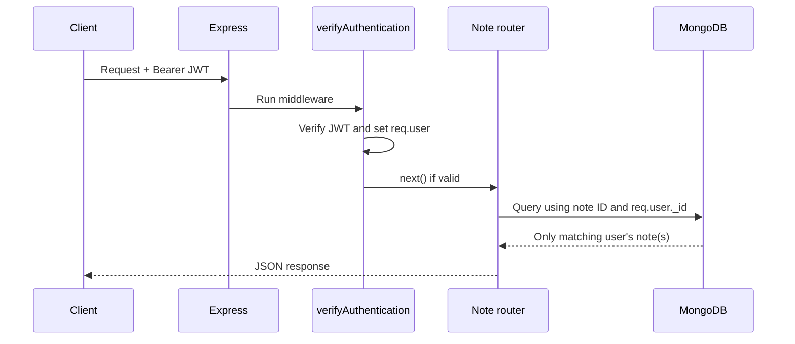

# User Authentication API

A small REST API built with Node.js, Express, MongoDB, and Mongoose. It demonstrates user registration, password hashing with bcrypt, login password verification, and JSON Web Token (JWT) creation and verification.

## Project overview

The application provides two authentication endpoints:

- Register a user with a username, email, and password.
- Log in with an email and password, then receive a signed JWT.

Passwords are hashed before they are saved to MongoDB. The login route compares the submitted password with the stored hash using the `isCorrectPassword` model method. JWTs currently contain the user’s MongoDB `_id` and `username` and expire after one hour.

## Project files

```text
lab-1/
├── .env                     # Local configuration and secrets (do not commit)
├── .gitignore
├── package.json
├── server.js                # Express app, database connection, auth routes, notes-router mount
├── router.js                # Authenticated note CRUD routes
├── Note.js                  # Mongoose note schema, including its owner reference
├── User.js                  # Mongoose user schema and password methods
├── verifyAuthentication.js  # Reusable Bearer-token verification middleware
└── README.md
```

## Requirements

- Node.js and npm
- A MongoDB database, either local or MongoDB Atlas
- Postman, Insomnia, or another HTTP client for testing

## Installation and configuration

Install dependencies from this project directory:

```sh
npm install
```

Create a `.env` file in the project root. Do not put real credentials in this README or commit the `.env` file.

```env
PORT=3001
MONGO_URI=mongodb://127.0.0.1:27017/module418_auth
JWT_SECRET=replace_this_with_a_long_random_secret
```

Use your actual MongoDB connection URI for `MONGO_URI`. `PORT` is optional; the server defaults to port `3001`. `JWT_SECRET` must be set to a private, sufficiently random value for signing and verifying tokens.

Start the development server with nodemon:

```sh
npm run dev
```

Or start it with Node directly:

```sh
npm start
```

The server prints its listening URL. If `PORT` is unset, it listens at `http://localhost:3001`.

## User model

The Mongoose schema in `User.js` defines:

| Field | Type | Rules |
| --- | --- | --- |
| `username` | String | Required, unique, trimmed |
| `email` | String | Required, unique, checked against a basic email pattern |
| `password` | String | Required, minimum 8 characters |
| `createdAt` / `updatedAt` | Date | Automatically added by Mongoose timestamps |

The `pre('save')` hook hashes a new or modified password with bcrypt using 10 salt rounds. The `isCorrectPassword(password)` instance method calls `bcrypt.compare()` and resolves to `true` or `false`.

## API endpoints

All request bodies should be sent as JSON. The server enables `express.json()` middleware, so in Postman choose **Body → raw → JSON**. Do not send registration or login fields as URL query parameters or as custom headers.

### Register

```http
POST http://localhost:3001/api/users/register
Content-Type: application/json
```

Example body:

```json
{
	"username": "anjan",
	"email": "anjan@example.com",
	"password": "securepass123"
}
```

On success, the current implementation responds with status `201` and a JSON object containing a success message and a JWT. The token payload contains `_id` and `username` and expires in one hour. The user is saved in MongoDB with a hashed password.

If the email already exists, the route responds with status `400`. The schema also requires usernames and emails to be unique, so a duplicate username can fail during database validation as well.

### Log in

```http
POST http://localhost:3001/api/users/login
Content-Type: application/json
```

Example body:

```json
{
	"email": "anjan@example.com",
	"password": "securepass123"
}
```

On success, the current implementation responds with status `200`, a success message, and a one-hour JWT containing `_id` and `username`. If the email is not found or the password does not match, it returns the same generic `400` response so it does not disclose which credential was incorrect.

## Authentication and authorization flow

`verifyAuthentication.js` exports middleware that expects a request header in this format:

```http
Authorization: Bearer <token>
```

It verifies the token with `JWT_SECRET`, stores the decoded claims on `req.user`, then calls `next()`. Missing, malformed, expired, or invalid tokens receive a `401` response. In `router.js`, `router.use(verifyAuthentication)` protects every notes route. In `server.js`, `app.use('/api/notes', noteRoutes)` mounts that router, so its `GET /`, `POST /`, `PUT /:id`, `DELETE /:id`, and `GET /:id` paths become `/api/notes`, `/api/notes`, `/api/notes/:id`, `/api/notes/:id`, and `/api/notes/:id` respectively.

Authentication answers **who is making the request?** The verified JWT identifies the user. Authorization answers **which resource may that user access?** Each note query must also constrain the note's `user` field to `req.user._id`. A valid login alone must not grant access to every note.

The request flow is:

1. The user registers or logs in; the API returns a signed JWT containing the user's `_id` and `username`.
2. The client sends that token as `Authorization: Bearer <token>` on notes requests.
3. `verifyAuthentication` verifies the signature and expiration, attaches the decoded claims to `req.user`, then calls `next()`.
4. The note handler uses `req.user._id` to set ownership on create and filter reads, updates, and deletes.



## Note model and ownership

`Note.js` defines `title`, `content`, and `user`. The `user` field is a MongoDB ObjectId reference to `User` and is required. This stores the ownership relationship on each note; it does not automatically authorize requests. The server must include the owner in every relevant query.

When creating a note, assign `user` from `req.user._id`, which came from the verified token. Do not trust an owner ID supplied by the client. The current create handler spreads the request body first and then sets `user`, so the authenticated ID overrides a submitted `user` property. An explicit allowlist (`title`, `content`, and `user`) is clearer and prevents unintended fields from being passed through.

For the list endpoint, use a filter such as `Note.find({ user: req.user._id })`, not `Note.find({})`; an empty filter returns all notes. For one note, use `Note.findOne({ _id: req.params.id, user: req.user._id })`. `findOne` returns a single document or `null`; `find` always returns an array, even if it contains zero or one document.

## Why use `findOneAndUpdate` / `findOneAndDelete`?

The owner check has to be part of the database operation itself. For an update, the filter should match both the requested note ID and the authenticated user's ID:

```js
const note = await Note.findOneAndUpdate(
	{ _id: req.params.id, user: req.user._id },
	{ $set: updates },
	{ new: true, runValidators: true }
);
```

`findOneAndUpdate(filter, update, options)` accepts a filter object, so MongoDB updates only a document matching **both** conditions. `findByIdAndUpdate(id, update, options)` is a convenience method for looking up by ID alone; it does not take an ownership filter in place of its `id` argument. Passing `{ _id, user }` to `findByIdAndUpdate()` is therefore the wrong method/signature for this authorization check. The same distinction applies to deletion: use `findOneAndDelete({ _id, user: req.user._id })`, rather than passing a filter object to `findByIdAndDelete()`.

`$set` changes only the fields provided in `updates`, leaving other fields (especially `user`) unchanged. Construct `updates` from allowed editable properties such as `title` and `content`; do not blindly pass the complete request body to the update operation. `{ new: true }` asks Mongoose to return the updated document, and `runValidators: true` runs schema validators on the update.

If an owner-scoped lookup returns `null`, respond with `404`. This treats a note owned by someone else the same as a nonexistent note, so the API does not reveal whether another user's note ID exists.

### Current implementation note

The current `router.js` update handler uses `{ $set: updates }` but does not define `updates` inside the handler. A PUT request will therefore fail with a `ReferenceError` until that object is built from allowed fields, for example:

```js
const updates = {};
if (req.body.title !== undefined) updates.title = req.body.title;
if (req.body.content !== undefined) updates.content = req.body.content;
```

Then pass `updates` to `findOneAndUpdate` as shown above. The current create handler accepts `...req.body` before overriding `user`; it is ownership-safe because `user` is assigned afterward, but explicit field selection is the recommended allowlist.

## Notes API quick reference

All notes endpoints require a valid Bearer token. The `:id` value is the note's MongoDB document ID.

| Method and path | Purpose | Ownership rule |
| --- | --- | --- |
| `GET /api/notes` | List the caller's notes | Filter by `user: req.user._id` |
| `GET /api/notes/:id` | Get one note | Match both `_id` and `user` |
| `POST /api/notes` | Create a note | Set `user` from `req.user._id` |
| `PUT /api/notes/:id` | Update a note | Match both `_id` and `user`; only allow editable fields |
| `DELETE /api/notes/:id` | Delete a note | Match both `_id` and `user` |

Example create body (the user/owner ID is intentionally omitted):

```json
{
	"title": "Study notes",
	"content": "Review authentication and authorization."
}
```

In Postman, select the correct HTTP method and URL, choose **Body → raw → JSON** for POST/PUT, and set **Authorization → Bearer Token** (or add the `Authorization: Bearer <token>` header). A GET request generally does not need a JSON body.

## Issues encountered and resolutions

### 1. POST requests returning 404

The application defines `POST /api/users/register` and `POST /api/users/login`; a browser address bar sends a `GET` request, not a `POST`. Use Postman or another HTTP client, select the POST method, and use the exact path and port printed by the server. The default port is `3001` unless `.env` sets `PORT`.

### 2. Sending credentials in headers or URL parameters

The routes read credentials from `req.body`, not from request headers or `req.query`. Send username, email, and password in a JSON body. `Content-Type: application/json` describes that body’s format; it does not carry the credentials itself. Avoid putting passwords in URLs because URLs can be retained in browser history, logs, and monitoring systems.

### 3. JSON body not being available

Express does not parse JSON bodies by default. `app.use(express.json())` is registered before the authentication routes in `server.js`, allowing the handlers to read values from `req.body`.

### 4. Password hashing and comparison

The password hook uses an asynchronous function and returns its promise to Mongoose; it should not also accept a `next` callback unless it calls that callback. The current hook omits the callback and awaits bcrypt hashing. `isCorrectPassword()` compares the submitted plain-text password with the stored bcrypt hash; passwords should never be manually hashed before sending them to the registration endpoint.

### 5. JWT payload changes do not update existing tokens

JWTs are signed snapshots. Updating the code to include `username` in the payload affects tokens created afterward; it cannot change tokens that were already issued. Users do not need to register again—logging in again produces a fresh token with the current `_id` and `username` claims. Existing tokens remain unchanged until expiration.

### 6. Invalid JSON body (`SyntaxError: Expected property name or '}'`)

`express.json()` parses the raw request body before the route handler runs. This error means the body is not valid JSON; the reported position/line/column points near the parse failure. JSON requires double-quoted property names and double-quoted strings, and does not allow comments or trailing commas. In Postman, choose **Body → raw → JSON** and send valid JSON. For GET requests, remove an unnecessary body. If parsing fails, the route handler has not run yet.

### 7. Distinguishing authentication from authorization

A request can be authenticated but still not be authorized to access a particular note. Applying `verifyAuthentication` proves the caller has a valid token; it does not by itself restrict which note IDs they can use. Include `user: req.user._id` in each read/update/delete filter, and set the same value during creation. Otherwise a logged-in user could potentially access another user's note by guessing or obtaining its ID.

### 8. `findByIdAndUpdate` / `findByIdAndDelete` do not express the owner filter

The `findById...` methods are designed around an ID argument, not a compound `{ _id, user }` filter. Use `findOneAndUpdate({ _id, user }, ...)` and `findOneAndDelete({ _id, user })` so the ownership condition is applied atomically as part of the database lookup. This avoids a separate check-then-update gap and ensures the operation only matches an owned note.

### 9. Calling functions versus registering Express middleware

Writing `verifyAuthentication; getUser;` inside a route callback only references those functions; it does not invoke them or send a response. Register middleware as route arguments, in order, for example `app.get('/api/users/', verifyAuthentication, getUser)`. Express invokes each handler and proceeds when middleware calls `next()`.

### 10. Starting the server command

The development script is `npm run dev` (with `npm`), as declared in `package.json`. A typo such as `pm run dev` fails because `pm` is not the npm command. Run the command from this project's directory.

### 11. MongoDB database visibility

Connecting to MongoDB does not necessarily create a database visible in the database list. MongoDB generally materializes a database/collection on the first write. After successfully creating a user or note, refresh the database view and verify you are looking at the cluster/database specified by `MONGO_URI`.


